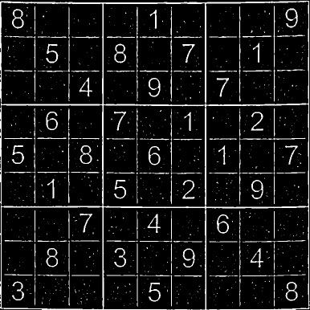
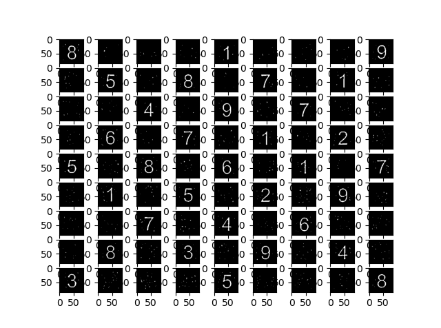

# ReadMe

This project aims to solve sudoku while extracting the digits from an image .

## Approach

The approach is as follows:

1. Extract the puzzle area from the image and transform it into a square .
2. Extract cell of the puzzle.
3. Apply OCR to recognize the digits, if any append the recognised digit or else append 0 to the question string.
4. Now pass the string into the solver. The solver uses the algorithm proposed by [Peter Norvig](https://norvig.com/sudoku.html).

## Images

### Original Image

### Finding the puzzle area in the image

### Extarcting the Puzzle Area

### Inverse Image of Puzzle Area

### Extracted Digits

